# JXWAF 最佳实践

## 部署

#### 架构图

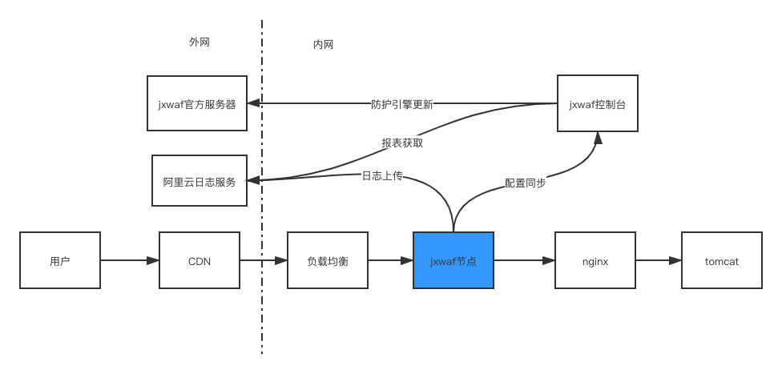

- 蓝色为 jxwaf 节点的部署位置
- 日志对接的是阿里云日志服务

#### 环境准备

- jxwaf 节点
  - Centos 7.4
- jxwaf 控制台
  - Centos 7.4
- 数据库
  - Mysql/Mariadb

#### 快速部署(源码部署)

**控制台部署**

需要先部署好数据库，假设数据库地址为 192.168.1.1，端口为 3306，账号为 root，密码为 123456，数据库为 jxwaf

1.  \$ yum install git -y
2.  \$ cd /opt
3.  \$ git clone https://github.com/jx-sec/jxwaf-mini-server.git
4.  \$ cd jxwaf-mini-server/
5.  \$ sh install.sh
6.  \$ pip install -r requirements.txt
7.  \$ vim jxwaf2018/settings.py

```
# Database
# https://docs.djangoproject.com/en/1.9/ref/settings/#databases
#DATABASES = {
#    'default': {
#        'ENGINE': 'django.db.backends.sqlite3',
#        'NAME': os.path.join(BASE_DIR, 'db.sqlite3'),
#    }
#}

DATABASES = {
 'default': {
     'ENGINE': 'django.db.backends.mysql',
     'NAME': 'jxwaf',
     'USER': 'root',
     'PASSWORD': '123456',
     'HOST': '192.168.1.1',
     'PORT': '3306',
 }
}

```

6.  \$ python manage.py makemigrations
7.  \$ python manage.py migrate
8.  \$ nohup python manage.py runserver 0.0.0.0:80 &
9.  假设服务器 IP 为 10.0.0.1,则打开网址 http://10.0.0.1 进行注册,注册完后登录账号,在 WAF 更新-> 语义引擎更新 中选择 语义引擎版本 加载。在 WAF 更新-> 人机识别更新 中 选择 人机识别版本 加载，同时点击 KEY 更新 加载人机识别对应的 KEY
10. 生产环境建议通过 nginx+uwsgi 部署，详情可参考文档 https://www.runoob.com/django/django-nginx-uwsgi.html 或自行百度。直接部署默认为调试模式，不要直接对公网开放访问。
11. 注册账号后，可通过 jxwaf2018/settings.py 文件中的 OPEN_REGIST = True 修改为 OPEN_REGIST = False 来关闭账号注册功能

**节点部署**

1.  \$ yum install git -y
2.  \$ cd /tmp
3.  \$ git clone https://github.com/jx-sec/jxwaf.git

```
提示: 国内服务器github下载较慢，提供百度网盘下载
https://pan.baidu.com/s/1WAt077rrOSNZj1E4X1u6pw 提取码: vcgw
```

4.  \$ cd jxwaf
5.  \$ sh install_waf.sh
6.  \$ 运行后显示类似信息即安装成功:

```
nginx: the configuration file /opt/jxwaf/nginx/conf/nginx.conf syntax is ok
nginx: configuration file /opt/jxwaf/nginx/conf/nginx.conf test is successful
```

7.  假设管理中心 IP 为 10.0.0.1,则打开网址 http://10.0.0.1 进行注册,注册完后登录账号,在 WAF 管理下的全局配置页面获取"api key"和"api password"
8.  \$ cd tools
9.  \$ python jxwaf_local_init.py --api_key=a2dde899-96a7-40s2-88ba-31f1f75f1552 --api_password=653cbbde-1cac-11ea-978f-2e728ce88125 --waf_server=http://10.0.0.1
10. api_key 为全局配置页面中"api key"的值，api_password 为"api password"的值，运行完成后，显示类似信息即安装成功

```
config file:  /opt/jxwaf/nginx/conf/jxwaf/jxwaf_config.json
config result:
init success,access_id is d7b9fe12-606c-4ca8-bcb5-3dde9853e5f4,access_secret is af5cfc8d-d564-44dd-ba11-f1fecdf95706
auth result:
try to connect jxwaf server auth api_key and api_password,result is True
```

11. \$ /opt/jxwaf/nginx/sbin/nginx
12. 启动 openresty,openresty 会在启动或者 reload 的时候自动到 jxwaf 管理中心拉取用户配置的最新规则,之后会定期同步配置,周期可在全局配置页面设置。

#### 阿里云日志部署

1. 创建 Project

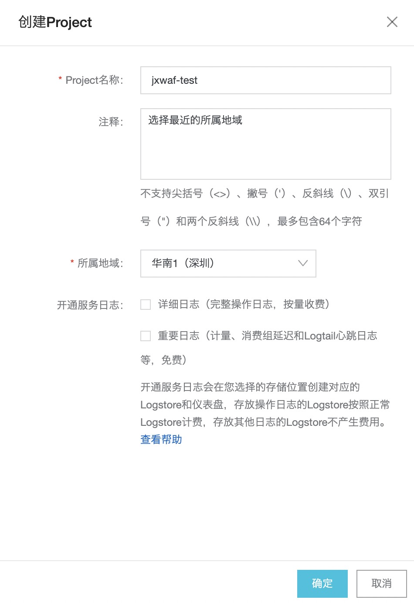

2. 创建 Logstore

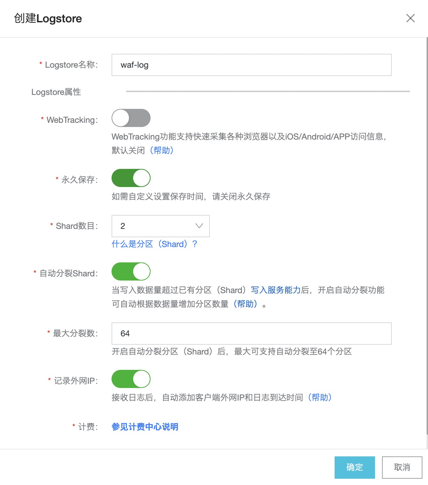

3. 安装 logtail

Logtail 客户端是阿里云日志服务提供的日志采集客户端

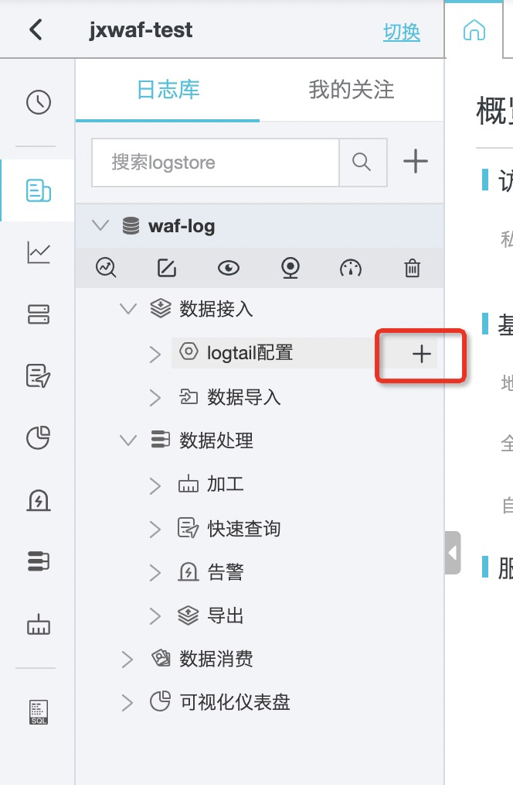

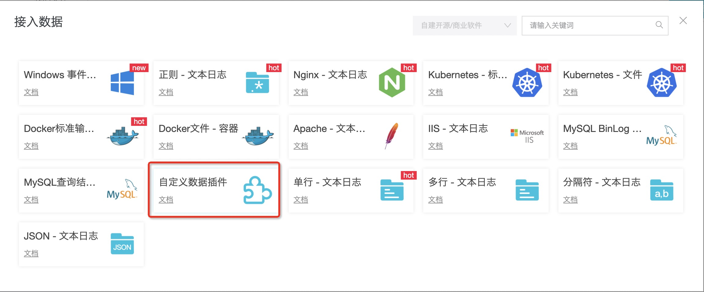

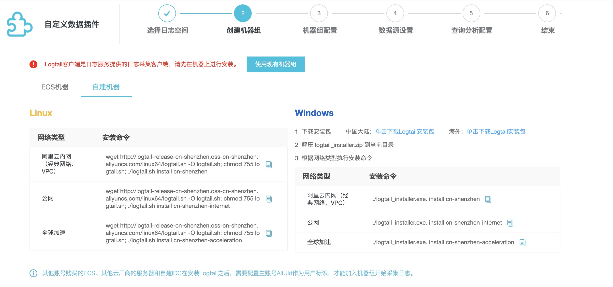

4. \$ wget http://logtail-release-cn-shenzhen.oss-cn-shenzhen.aliyuncs.com/linux64/logtail.sh -O logtail.sh; chmod 755 logtail.sh; ./logtail.sh install cn-shenzhen-internet

```
logtail-linux64.tar.gz download success
install logtail files success
chkconfig add ilogtaild success
install logtail success
ilogtail is running
start logtail success
{
   "UUID" : "8A134173-30E7-4CC9-B924-34ABEC00D81B",
   "hostname" : "VM-16-12-centos",
   "instance_id" : "C36692DC-0C6D-11EB-A61A-525400473BD9_172.16.16.12_1602495113",
   "ip" : "172.16.16.12",
   "logtail_version" : "0.16.48",
   "os" : "Linux; 3.10.0-693.el7.x86_64; #1 SMP Tue Aug 22 21:09:27 UTC 2017; x86_64",
   "update_time" : "2020-10-12 17:31:53"
}
```

5. 创建主账号 AliUid 同名文件到 /etc/ilogtail/users 目录，如目录不存在请手动创建目录。一台服务器上可以配置多个主账号 AliUid，例如：

```
touch /etc/ilogtail/users/1833192882890167
touch /etc/ilogtail/users/1833192882890167
```

6. 创建机器组，ip 为步骤 4 中的输出，这里为 172.16.16.12

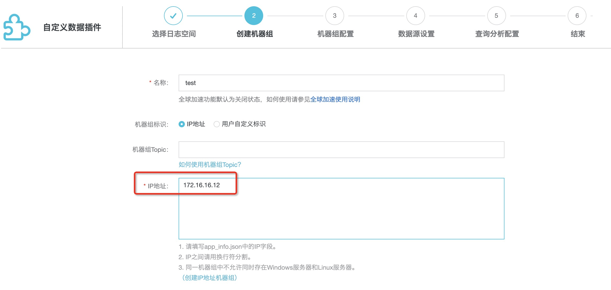

7.机器组创建成功
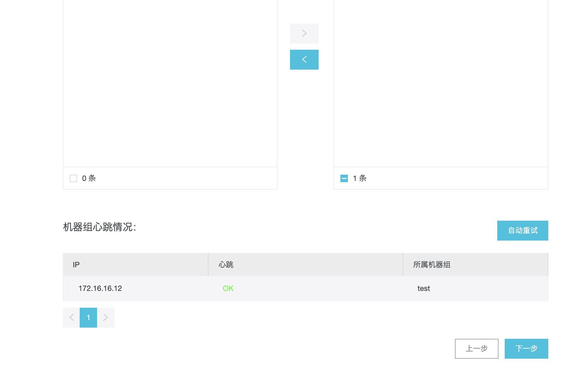

8. 数据源设置

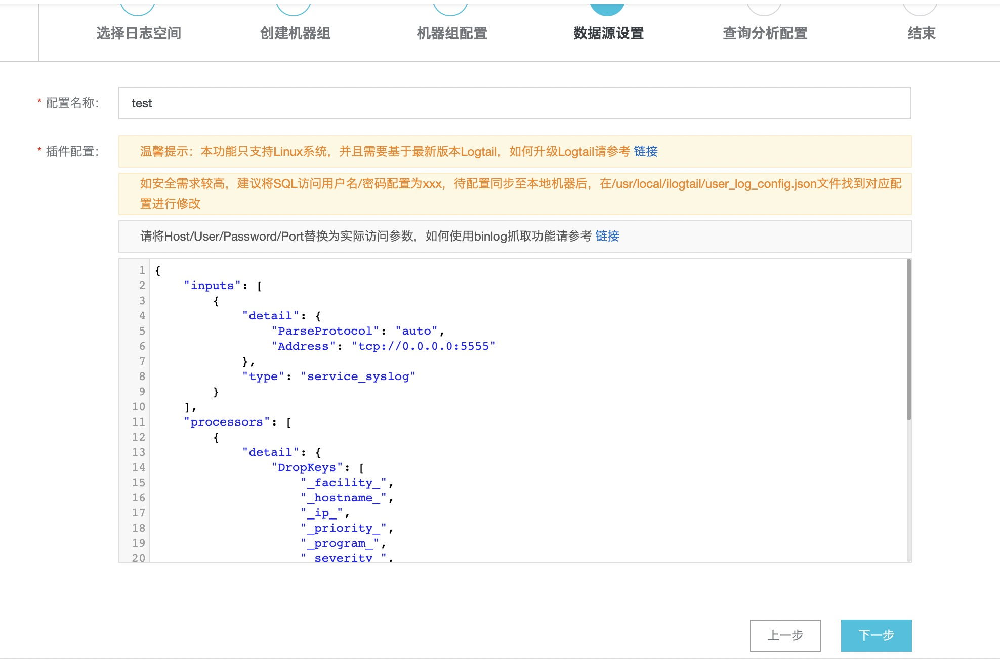

```
{
    "inputs": [
        {
            "detail": {
                "ParseProtocol": "auto",
                "Address": "tcp://0.0.0.0:5555"
            },
            "type": "service_syslog"
        }
    ],
    "processors": [
        {
            "detail": {
                "DropKeys": [
                    "_facility_",
                    "_hostname_",
                    "_ip_",
                    "_priority_",
                    "_program_",
                    "_severity_",
                    "_unixtimestamp_"
                ]
            },
            "type": "processor_drop"
        },
        {
            "detail": {
                "KeepSource": false,
                "ExpandDepth": 0,
                "ExpandConnector": "",
                "SourceKey": "_content_",
                "NoKeyError": true
            },
            "type": "processor_json"
        }
    ]
}
```

9. 索引生成

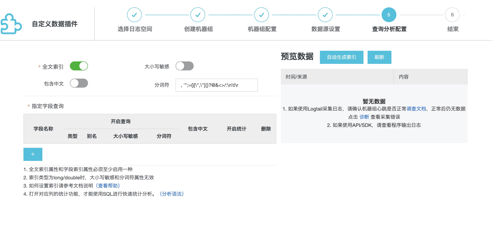

该步骤可以在后续手动创建，不过建议通过日志来自动生成，可参考如下设置，细节请查看后续的 配置 章节。

在控制台 全局配置 -> 日志配置


配置完成后，对网站发起请求，出现如下页面即日志接收成功

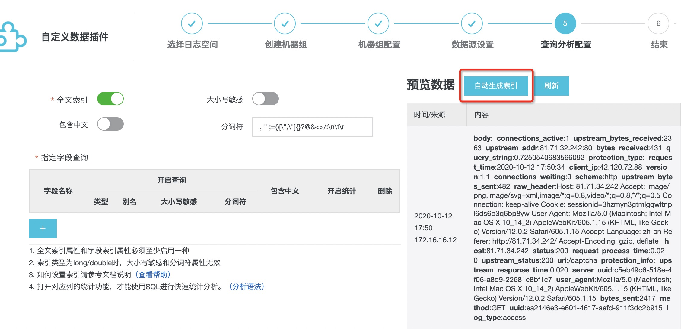
点击 自动生成索引 确定即可

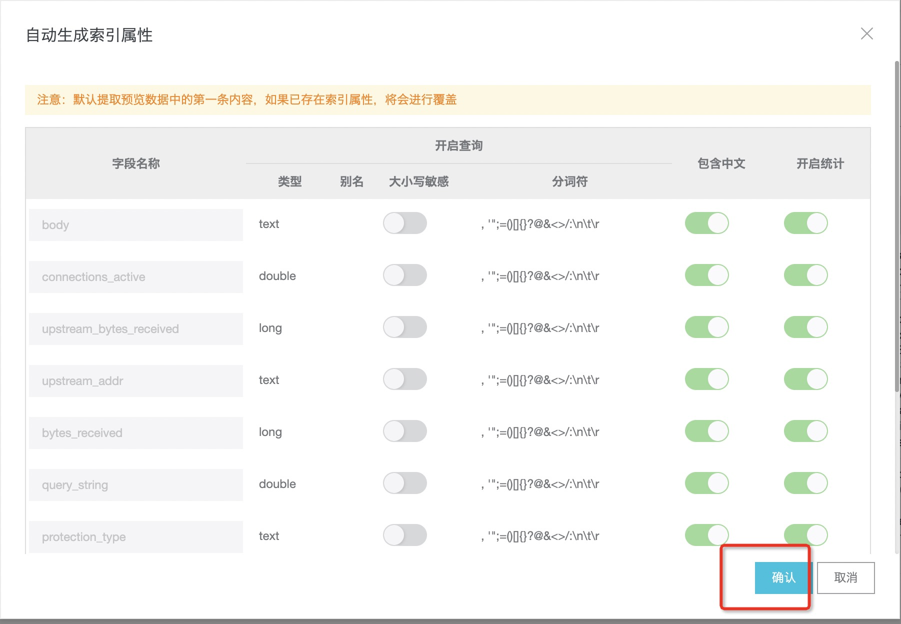

10. 以上环节如出现问题请查看官方文档 https://help.aliyun.com/product/28958.html 或 找官方支持。

## 配置

域名: 81.71.34.242

业务服务器 IP: 81.71.32.242

#### 控制台配置

1. 添加网站

网站配置 -> 添加网站

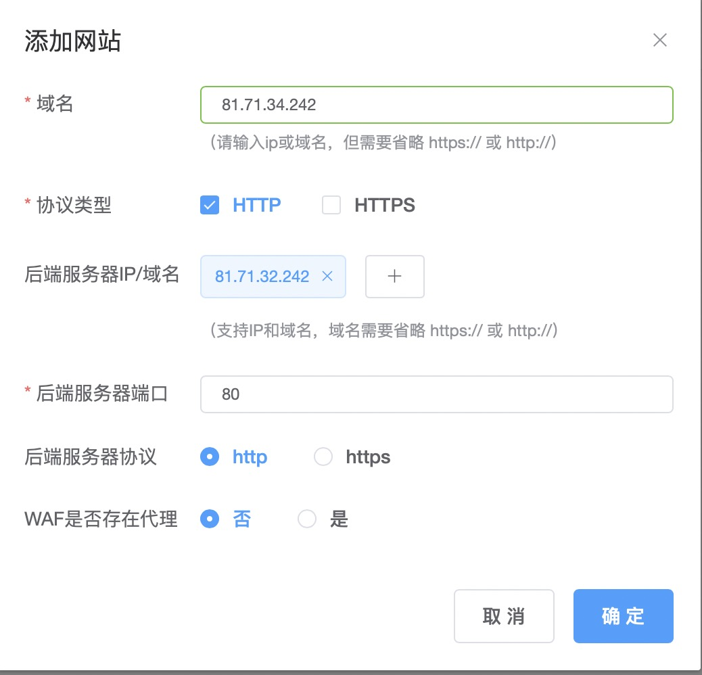

2. 日志配置

全局配置 -> 日志配置


3.  阿里云日志配置

全局配置 -> 阿里云日志配置
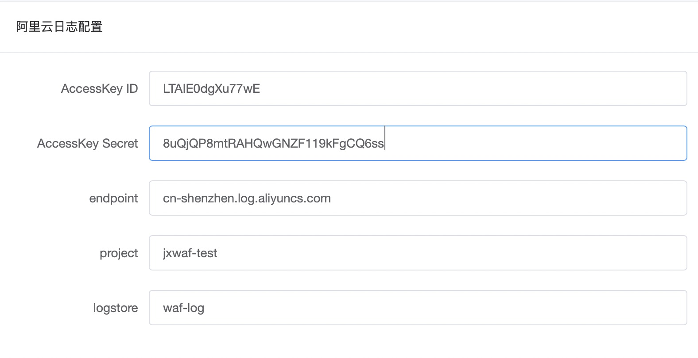

4. 报表展示

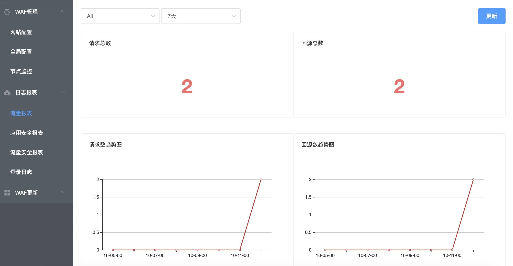
