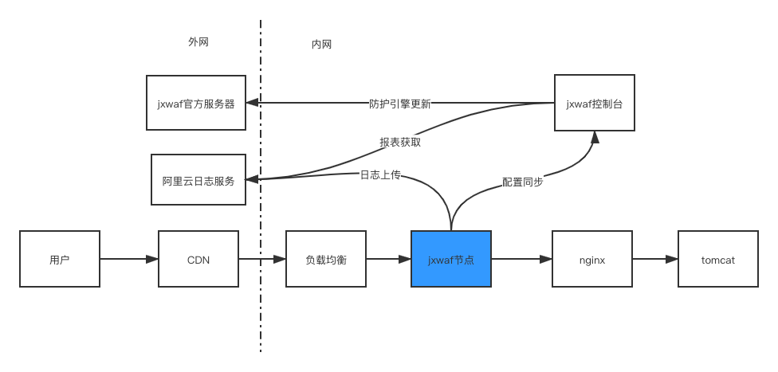
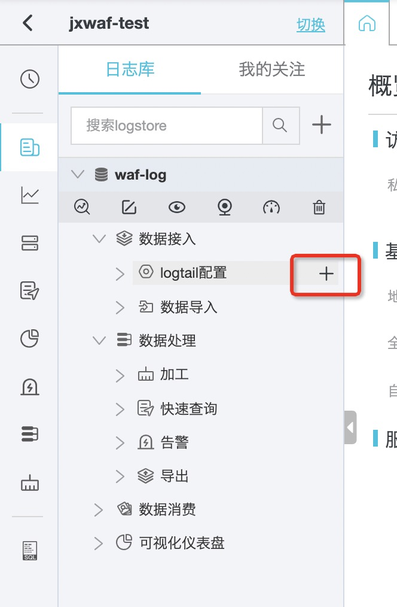
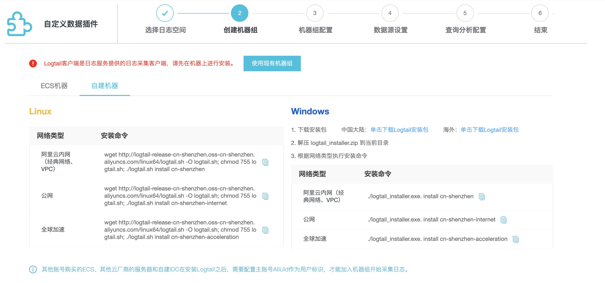
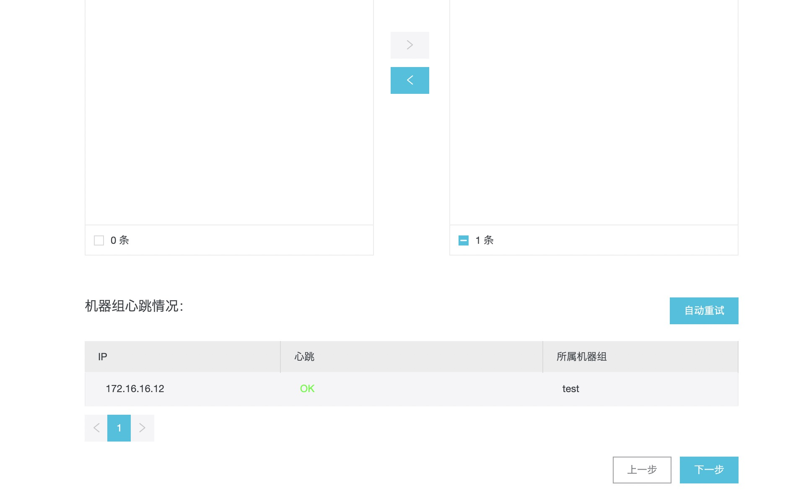
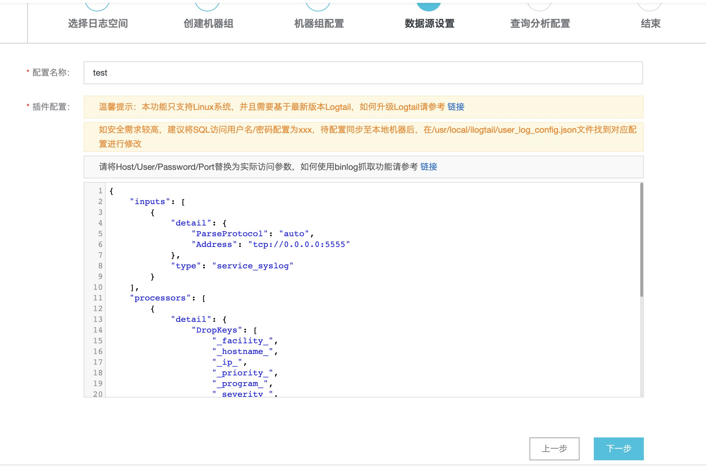
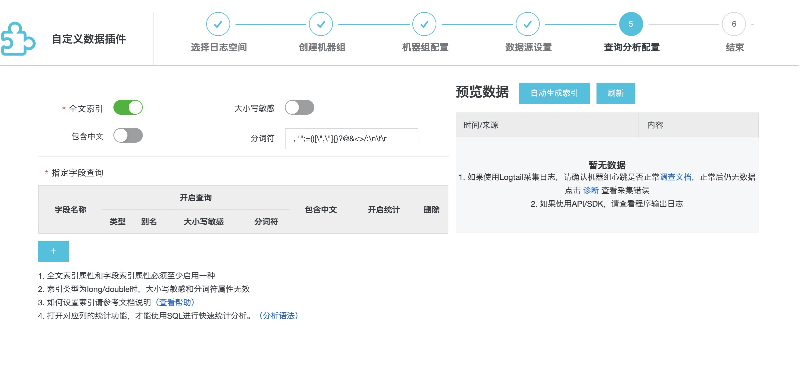
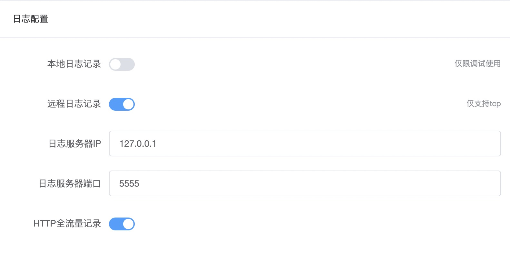
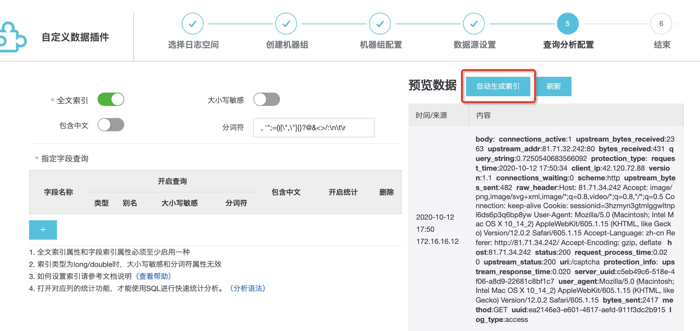
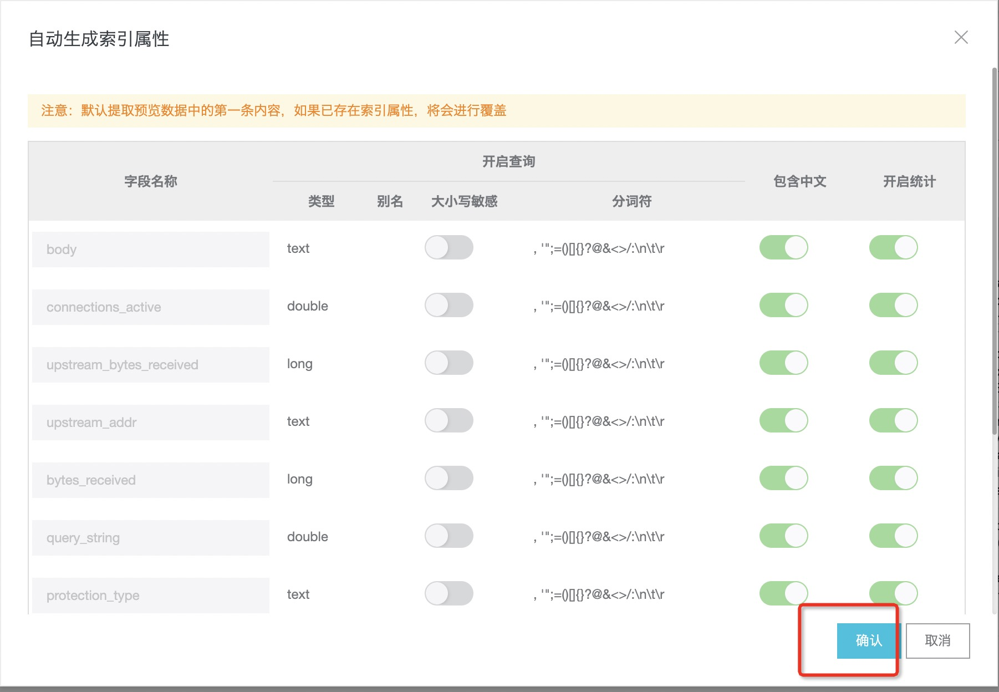
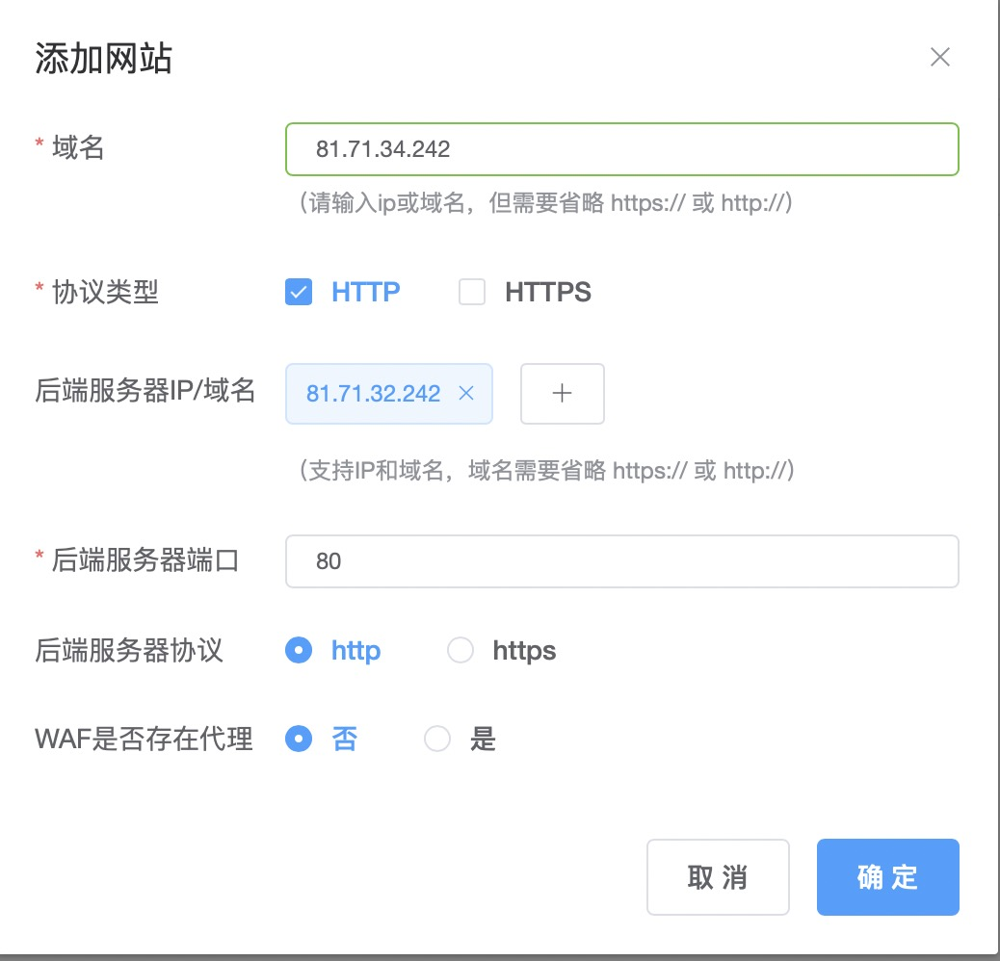

# JXWAF best practices

## Deployment

#### Schema diagram



- Blue is where the jxwaf node is deployed
- The log docking is the Alibaba Cloud log service

#### Environment preparation

- jxwaf node
  - Centos 7.4
- jxwaf Console
  - Centos 7.4
- Database
  - Mysql/Mariadb

#### Rapid deployment (source deployment)

**Console deployment**

The database needs to be deployed first, assuming a database address: 192.168.1.1, port: 3306, account: root, password: 123456, and database jxwaf

1.  \$ yum install git -y
2.  \$ cd /opt
3.  \$ git clone https://github.com/jx-sec/jxwaf-mini-server.git
4.  \$ cd jxwaf-mini-server/
5.  \$ sh install.sh
6.  \$ pip install -r requirements.txt
7.  \$ vim jxwaf2018/settings.py

```
# Database
# https://docs.djangoproject.com/en/1.9/ref/settings/#databases
#DATABASES = {
#    'default': {
#        'ENGINE': 'django.db.backends.sqlite3',
#        'NAME': os.path.join(BASE_DIR, 'db.sqlite3'),
#    }
#}

DATABASES = {
 'default': {
     'ENGINE': 'django.db.backends.mysql',
     'NAME': 'jxwaf',
     'USER': 'root',
     'PASSWORD': '123456',
     'HOST': '192.168.1.1',
     'PORT': '3306',
 }
}

```

6.  \$ python manage.py makemigrations
7.  \$ python manage.py migrate
8.  \$ nohup python manage.py runserver 0.0.0.0:80 &
9.  Assuming a server IP of 10.0.0.1, open URL http://10.0.0.1 to register, log in to your account after registration, and select the Semantic Engine version to load in the WAF Update-> Semantic Engine Update. In WAF Update-> Human Machine Recognition Update, select The Human Machine Identification Version Load, and click KEY Update Loader Identification for KEY
10. The production environment is recommended for deployment via nginx+uwsgi, and details can be https://www.runoob.com/django/django-nginx-uwsgi.html or self-contained Google. Direct deployment defaults to debug mode and does not open access directly to the public network.
11. After you register your account, you can turn off your account registration function by changing the OPEN_REGIST = True to OPEN_REGIST = False in the jxwaf2018/settings.py file

**节点部署**

1.  \$ yum install git -y
2.  \$ cd /tmp
3.  \$ git clone https://github.com/jx-sec/jxwaf.git

```
Tip: If you are in China, github download is slow and offers Baidu disk download
https://pan.baidu.com/s/1WAt077rrOSNZj1E4X1u6pw code: vcgw
```

4.  \$ cd jxwaf
5.  \$ sh install_waf.sh
6.  \$ When you run, you display a similar message that the installation was successful:

```
nginx: the configuration file /opt/jxwaf/nginx/conf/nginx.conf syntax is ok
nginx: configuration file /opt/jxwaf/nginx/conf/nginx.conf test is successful
```

7.  Assuming a Central Administration IP of 10.0.0.1, open URL http://10.0.0.1 to register, log in to your account after registration, and get "api key" and "api password" on the global configuration page managed by WAF
8.  \$ cd tools
9.  \$ python jxwaf_local_init.py --api_key=a2dde899-96a7-40s2-88ba-31f1f75f1552 --api_password=653cbbde-1cac-11ea-978f-2e728ce88125 --waf_server=http://10.0.0.1
10. api_key the value of "api key" in the global configuration page, the value of api_password is "api password" and the installation is successful when the run is complete

```
config file:  /opt/jxwaf/nginx/conf/jxwaf/jxwaf_config.json
config result:
init success,access_id is d7b9fe12-606c-4ca8-bcb5-3dde9853e5f4,access_secret is af5cfc8d-d564-44dd-ba11-f1fecdf95706
auth result:
try to connect jxwaf server auth api_key and api_password,result is True
```

11. \$ /opt/jxwaf/nginx/sbin/nginx
12. Start openresty, which automatically pulls the latest rules for user configuration to the jxwaf Management Center when you start or reload, and then syncs the configuration periodically, with cycles set on the global configuration page.

#### Alibaba Cloud Log Deployment

1. Create Project


2. Create Logstore


3. Install logtail

Logtail client is a log acquisition client provided by Alibaba Cloud Log Services






4. \$ wget http://logtail-release-cn-shenzhen.oss-cn-shenzhen.aliyuncs.com/linux64/logtail.sh -O logtail.sh; chmod 755 logtail.sh; ./logtail.sh install cn-shenzhen-internet

```
logtail-linux64.tar.gz download success
install logtail files success
chkconfig add ilogtaild success
install logtail success
ilogtail is running
start logtail success
{
   "UUID" : "8A134173-30E7-4CC9-B924-34ABEC00D81B",
   "hostname" : "VM-16-12-centos",
   "instance_id" : "C36692DC-0C6D-11EB-A61A-525400473BD9_172.16.16.12_1602495113",
   "ip" : "172.16.16.12",
   "logtail_version" : "0.16.48",
   "os" : "Linux; 3.10.0-693.el7.x86_64; #1 SMP Tue Aug 22 21:09:27 UTC 2017; x86_64",
   "update_time" : "2020-10-12 17:31:53"
}
```

5. Create a master account AliUid file with the same name to the /etc/ilogtail/users directory, if the directory does not exist please manually create the directory. Multiple primary accounts ( AliUid ) can be configured on one server，For example：

```
touch /etc/ilogtail/users/1833192882890167
touch /etc/ilogtail/users/1833192882890167
```

6. Create a machine group，ip is the output in step 4, here at 172.16.16.12


7.The machine group was created successfully


8. Data source settings



```
{
    "inputs": [
        {
            "detail": {
                "ParseProtocol": "auto",
                "Address": "tcp://0.0.0.0:5555"
            },
            "type": "service_syslog"
        }
    ],
    "processors": [
        {
            "detail": {
                "DropKeys": [
                    "_facility_",
                    "_hostname_",
                    "_ip_",
                    "_priority_",
                    "_program_",
                    "_severity_",
                    "_unixtimestamp_"
                ]
            },
            "type": "processor_drop"
        },
        {
            "detail": {
                "KeepSource": false,
                "ExpandDepth": 0,
                "ExpandConnector": "",
                "SourceKey": "_content_",
                "NoKeyError": true
            },
            "type": "processor_json"
        }
    ]
}
```

9. The index is generated



This step can be created manually later, but it is recommended that it be generated automatically through logs, as setup below, as detailed in the "Configuration" section.

In the console, Global configuration - > Log configuration



When the configuration is complete, a request is made to the site, and the following page appears, which means that the log was received successfully


Click "Auto-index" to determine



10. Please review the official documentation if there is a problem with the above steps https://help.aliyun.com/product/28958.html Or get official support.

## Configuration.

Domain name: 81.71.34.242

业务服务器 IP: 81.71.32.242

#### Console configuration

1. Add a site

"My Websites" - > "Add"



2. Log configuration

"Global Setting" -> "Logging Setting"


3.  AliCloud Logging Setting

"Global Setting" -> "AliCloud Logging Setting"


4. Report presentation


